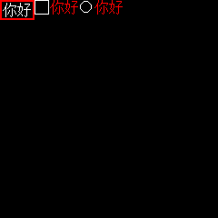

# XT_GUI

这是一个基于 [micropython](https://docs.micropython.org/en/latest/library/index.html) 的 轻量级 GUI 库.

使用 [micropython](https://docs.micropython.org/en/latest/library/index.html) 中的 [framebuf](https://docs.micropython.org/en/latest/library/framebuf.html) 库，构建一个高效帧缓冲，GUI 所有的绘制操作都先在帧缓冲上进行再同步到 GDDRAM，实现双缓冲绘图。

注意：目前只支持 RGB565 屏幕

- [XT\_GUI](#xt_gui)
  - [硬件要求](#硬件要求)
  - [快速上手](#快速上手)
    - [远程调试(无需安装)](#远程调试无需安装)
    - [安装](#安装)
  - [参考文档](#参考文档)
  - [1. 基础](#1-基础)
    - [1.1 文字显示](#11-文字显示)
      - [使用你自己的字体库](#使用你自己的字体库)
    - [1.2 按键响应](#12-按键响应)
    - [1.3 显示器驱动](#13-显示器驱动)
  - [2. 示例代码详细说明](#2-示例代码详细说明)
  - [3. Q\&A](#3-qa)
  - [4. TODO List](#4-todo-list)
  - [5. 开发者请看](#5-开发者请看)

## 硬件要求

运行 python 解释器后剩余空闲内存大于整个屏幕帧缓冲占用的空间，并至少留有 10KByte。

```python
# 占用空间简单计算公式
_1位单色屏 = ceil(width/8)*height
_RGB565屏 = width*height*2
```

例如：

SSD1306 分辨率为 128x64，色彩模式 1 位单色。帧缓冲占用空间为 1024 Byte；

ST7789 分辨率为 240x240，色彩模式 RGB565。帧缓冲占用空间为 115,200 Byte

## 快速上手

### 远程调试(无需安装)

该方法不会改变主机的文件系统，但运行速度非常慢，而且内存占用大。

1. 准备运行`micropython`的开发板和一个`ST7789`的`LCD`屏幕，并使用 4 线串行接口的方式完成连接
2. 克隆或下载本仓库到 PC 机本地
3. 打开`setup_hardware.py`并修改相关引脚配置

   ```python
   # 请根据自身硬件情况更改引脚和波特率
   # 初始化显示屏
   spi0 = SPI(0, baudrate=30_000_000, phase=1, polarity=1, sck=Pin(2), mosi=Pin(3))
   display_driver = st7789.ST7789(
      spi0, 240, 240, reset=Pin(0, Pin.OUT), dc=Pin(1, Pin.OUT)
   )
   display = st7789.ST7789_API(display_driver)
   ```

4. 下载官方的 [mpremote](https://docs.micropython.org/en/latest/reference/mpremote.html#mpremote) 工具`pip3 install mpremote`
5. 挂载代码目录到主机(请确保运行命令时路径处于代码目录，串口不被其他程序占用)`mpremote mount .`
6. 运行你想运行的 demo`>>> import demos.foo_bar`
7. 部分 demo 中有些代码需要修改引脚等

### 安装

将以下文件结构全部复制到主机的根目录下:

- demos/
- driver/
- gui/
- resource/
- setup_hardware.py

根据实际情况还可添加`add_ons/`

根据自身情况修改引脚号等，然后在根目录下运行你想运行的 demo`>>> import demos.foo_bar`

## 参考文档

- [示例](./docs/Demos.md)
- [所有控件列表](./docs/All%20widgets%20list.md)
- - [基础控件](./docs/All%20widgets%20list.md)
- - [高级控件](./docs/All%20widgets%20list.md)
- - [特殊控件](./docs/All%20widgets%20list.md)
- [驱动列表](./docs/All%20driver%20list.md)
- [实用工具](./docs/Utils.md)
- 核心组件
- - [物理按键处理](./docs/KeyHandler.md)
- - [XT_GUI类](./docs/XT_GUI.md)

## 1. 基础

`xt-gui`的核心类为[XT_GUI](./docs/XT_GUI.md)。

`xt-gui`默认按键处理类使用了[asyncio](https://docs.micropython.org/en/latest/library/asyncio.html)，`xt-gui`通常也以异步协程的方式运行，但可以修改为同步方式。

`xt-gui`坐标系将左上角定义为(0,0)，向右下角移动为增加，横轴为x，纵轴为y。

`xt-gui`上显示的所有元素均由控件组成。

### 1.1 文字显示

字体读取与制作使用个人改进的[ufont](https://github.com/XuanTongYao/MicroPython-uFont)库，理论上支持显示UTF-16编码的所有字符，支持不完整的字符集。

`ufont`根据字符的Unicode点位码(序号)从文件中读取未压缩的Bitmap数据，`xt-gui`依据Bitmap数据和文本颜色进行上色转换为RGB565格式的像素数据，再绘制到屏幕上。

实拍效果图


#### 使用你自己的字体库

必须在类中实现以下的属性

```python
# 字体大小
font_size:int
# 获取字符的Bitmap数据并写入到buffer中
def fast_get_bitmap(self,char:str,buffer:bytearray)->None:
   pass
```

### 1.2 按键响应

`xt-gui`默认使用[KeyHandler](./docs/KeyHandler.md)类对单个物理按键进行处理。

使用回调的方式来响应按键触发事件，支持按下、抬起、长按事件，可以指定回调函数的参数。

下面是该类的部分源码，构造函数需要填入两个值:`key`必须实现`__call__`方法返回一个`int`或`bool`作为当前按键值、`active`定义了按键按下时应该为的值。`KeyHandler`类使用了[asyncio](https://docs.micropython.org/en/latest/library/asyncio.html)和状态机模式来实现消抖等操作。

如果你想自定义基于`asyncio`的按键处理类，必须实现其`__call__`方法用于启动相应的异步任务。

```python
class KeyHandler:

    def __init__(self, key, active=0) -> None:
        """
        Args:
            key: 按键对象，可以是Pin或其他，必须实现__call__方法用于获取按键值.
            active: 按键按下有效值. 默认0表示按下.
        """
        pass

    def __call__(self):
        self.__hold_sleep_task = asyncio.create_task(self.__hold_check(HOLD_MS / 1000))
        self.__scan_loop_task = asyncio.create_task(self.__do_scan_loop())
```

通常将按键事件的回调函数设置为`XT_GUI`实例的成员函数`key_response(key:int)`，参数设置为[按键键值](./docs/Utils.md)。

```py
key_enter = KeyHandler(setup_hardware.BTN_ENTER)
key_enter.set_press_func(GUI.key_response, KEY_MOUSE0)
```

`XT_GUI`类内部维护一个[控件栈](./ForDeveloper.md#已进入控件栈)，栈顶为当前进入的控件，当调用`key_response(key:int)`时，`XT_GUI`实例会将键值传递给栈顶控件，栈顶控件根据键值进行响应。

### 1.3 显示器驱动

`xt-gui`使用[DisplayAPI](./docs/Utils.md#displayapi)类作为屏幕驱动通用接口。

`DisplayAPI`构造时要求传入一个显示器驱动对象，该对象必须实现以下属性:

```py
# 显示器像素宽高
width: int
height: int
# 显示器颜色模式
color_mode: int
# 将buffer中的像素数据写入到显示器
# buffer包含了全屏幕的像素数据，从左上角开始，从左到右，从上到下依次写入
def write_gddram(self, buffer:bytearray):
   ...
```

## 2. 示例代码详细说明

下面以[buttons示例](./demos/buttons.py)为例，介绍`xt-gui`的使用。

首先来看[配置硬件](./setup_hardware.py)的部分。

根据你的情况，创建一个显示器驱动实例，并根据它来创建`DisplayAPI`实例。

```py
import gc
from machine import Pin, SPI

gc.collect()
from driver import st7789
from gui.utils.core import DisplayAPI
import machine

# 超频，你可以注释掉这条语句
machine.freq(250000000)

# 请根据自身硬件情况更改引脚和波特率等
# 初始化显示屏
spi0 = SPI(0, baudrate=30_000_000, phase=1, polarity=1, sck=Pin(2), mosi=Pin(3))
display_driver = st7789.ST7789(
    spi0, 240, 240, reset=Pin(0, Pin.OUT), dc=Pin(1, Pin.OUT)
)
display_driver.set_fullscreen()# 设置全屏刷新，不适用于其他驱动。
display = DisplayAPI(display_driver)
```

手动调用垃圾收集是防止内存碎片的产生，在内存较小的机器上很有用。

然后是初始化按键的部分，这里使用Pin类初始化两个物理按键，然后还使用了FJ08KN摇杆+ADC来模拟按键。请根据你自身情况调整引脚等，如果你没有FJ08KN摇杆请将摇杆部分的代码注释掉，然后使用另一种按键模式。理论上buttons示例中只使用**确认/进入按键**和**下键**就能运行。

**如果不需要进行截图请将`BTN_PRTSC`分配到一个上拉引脚上。**

```py
# 请根据自身硬件情况更改按键引脚

# 退出按键
BTN_ESCAPE = Pin(5, Pin.IN)
# 确认/进入按键
BTN_ENTER = Pin(6, Pin.IN, Pin.PULL_UP)
# # 下键
# BTN_DOWN = Pin(7, Pin.IN, Pin.PULL_UP)
# # 上键
# BTN_UP = Pin(8, Pin.IN, Pin.PULL_UP)
# 截图键用于调试
BTN_PRTSC = Pin(8, Pin.IN, Pin.PULL_UP)  # Debug

# FJ08KN摇杆模拟按键
from driver import fj08kn
from machine import ADC

gc.collect()

joystick = fj08kn.FJ08K(ADC(Pin(29)), ADC(Pin(28)))
BTN_UP = joystick.get_simulate_key(1)
BTN_DOWN = joystick.get_simulate_key(3)
```

硬件全部初始化完成后，就可以[开始使用](./demos/buttons.py)了。

导入必要的库文件。

```py
# 导入硬件配置文件，也就是上面代码的内容
import setup_hardware
# 字体加载库
from gui import ufont
# 通用工具
from gui.utils.core import *
# 物理按键处理类
from gui.key_handler import KeyHandler
# XT_GUI核心
from gui.xt_gui import XT_GUI
# 常见的按钮：普通按钮、复选框、单选按钮
from gui.widgets.buttons import XButton, XCheckbox, XRadio
```

创建XT_GUI实例。`load_into_mem=True`表示将字体文件全部加载到内存中(内存小慎用)，以减少文件读取次数。`loop_focus=True`表示焦点可以循环切换，而不是单向的。

```py
# 创建XT_GUI实例
GUI = XT_GUI(
    setup_hardware.display,
    ufont.BMFont("./resource/fonts/for_demo/16x16_text_demo.bmf", load_into_mem=True),
    loop_focus=True,
)
```

实例化各种按钮控件，并设置位置大小等参数，给第一个按钮绑定一个回调函数，按下时会执行，然后将其添加到XT_GUI实例中。

```py

def print_hello():
    print("Hello world!")

hello_button = XButton((0, 0), text="你好", key_press=print_hello)
hello_checkbox = XCheckbox((38, 0), (49, 16), 16, text="你好")
hello_radio = XRadio((87, 0), (49, 16), 16, text="你好")

# 添加控件
GUI.add_widgets((hello_button, hello_checkbox, hello_radio))

```

设置好按键处理类，并设置按键事件的回调函数。`set_press_func`用于设置按键按下时的回调函数，第一个参数为回调函数，第二个参数为调用回调应该传入的参数。

`GUI.key_response`是GUI处理按键响应的函数，调用这个函数并传入键值以告知GUI处理。

最后运行异步主循环

```py
key_esc = KeyHandler(setup_hardware.BTN_ESCAPE, press=(GUI.key_response, KEY_ESCAPE))
key_enter = KeyHandler(setup_hardware.BTN_ENTER, press=(GUI.key_response, KEY_MOUSE0))
key_next = KeyHandler(setup_hardware.BTN_DOWN, press=(GUI.key_response, KEY_DOWN))

# 启动异步主循环
GUI.run(key_esc, key_enter, key_next)
```

截屏效果图


## 3. Q&A

还不知道写什么，遇到任何问题都可以提issue。

## 4. TODO List

- [ ] 完善文档
- [x] 更新inputs控件模块
- [ ] 蜂鸣器播放音乐
- [ ] MIDI解码

## 5. 开发者请看

[开发者文档](./ForDeveloper.md)
