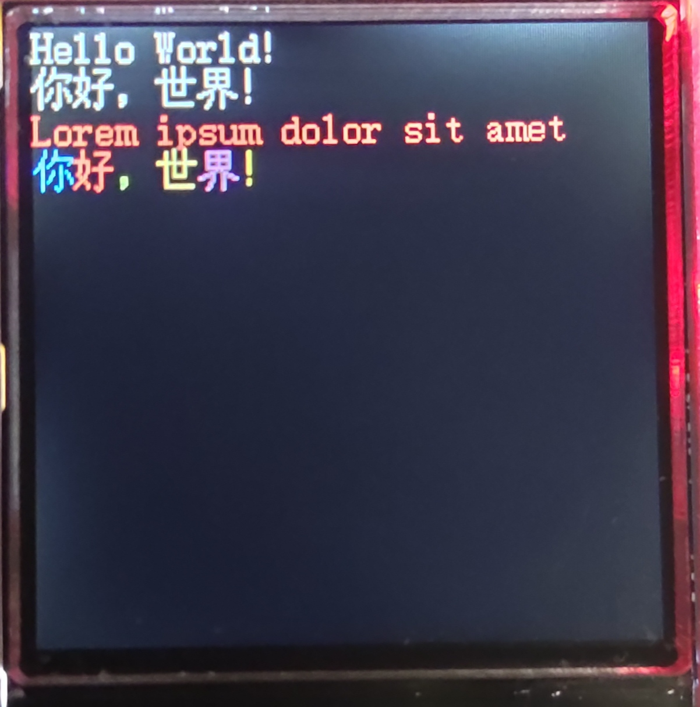
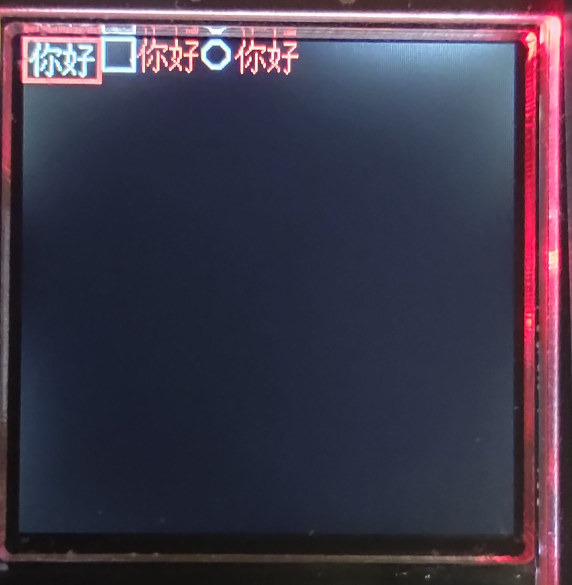
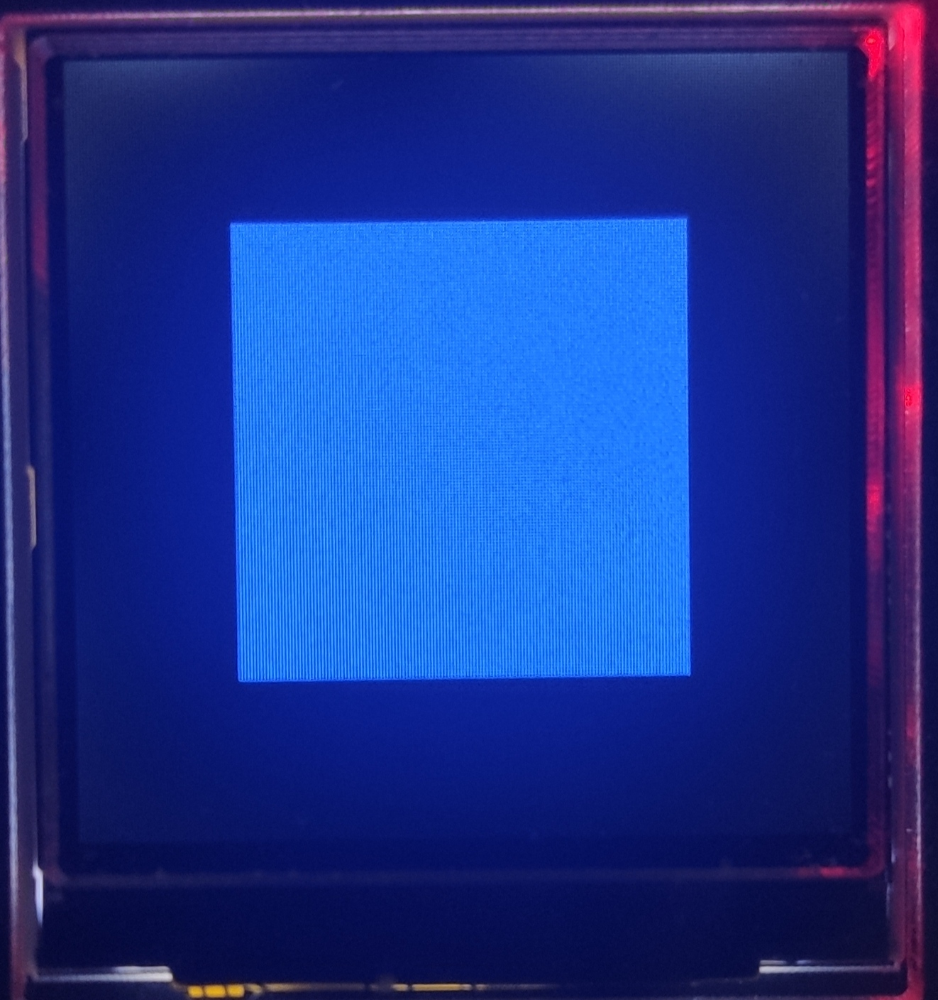
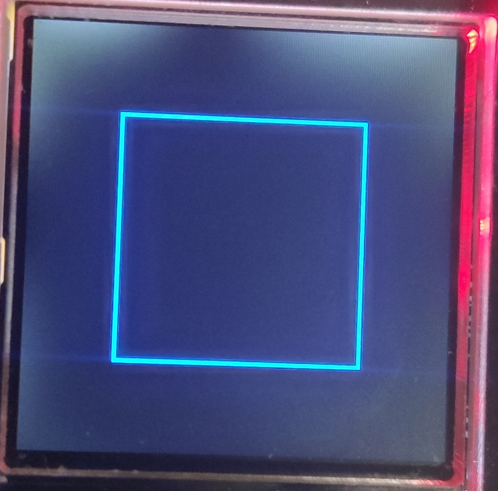

# XT_GUI

这是一个基于 [micropython](https://docs.micropython.org/en/latest/library/index.html) 的 轻量级 GUI 库.

使用 [micropython](https://docs.micropython.org/en/latest/library/index.html) 中的 [framebuf](https://docs.micropython.org/en/latest/library/framebuf.html) 库，构建一个高效帧缓存，GUI 所有的绘制操作都先在帧缓存上进行再同步到 GDDRAM，速度较快。

注意：目前只支持 RGB565 屏幕

## 硬件要求

运行 python 解释器后剩余空闲内存大于整个屏幕帧缓存占用的空间，并至少留有 10KByte。

```python
# 占用空间简单计算公式
_1位单色屏 = ceil(width/8)*height
_RGB565屏 = width*height*2
```

例如：

SSD1306 分辨率为 128x64，色彩模式 1 位单色。帧缓存占用空间为 1024 Byte；

ST7789 分辨率为 240x240，色彩模式 RGB565。帧缓存占用空间为 115,200 Byte

## 快速上手

### 远程调试(无需安装)

该方法不会改变主机的文件系统，但运行速度非常慢，而且内存占用大。

1. 准备运行`micropython`的开发板和一个`ST7789`的`LCD`屏幕，并使用 4 线串行接口的方式完成连接
2. 克隆或下载本仓库到 PC 机本地
3. 打开`setup_hardware.py`并修改相关引脚配置

   ```python
   # 请根据自身硬件情况更改引脚和波特率
   # 初始化显示屏
   spi0 = SPI(0, baudrate=30_000_000, phase=1, polarity=1, sck=Pin(2), mosi=Pin(3))
   display_driver = st7789.ST7789(
      spi0, 240, 240, reset=Pin(0, Pin.OUT), dc=Pin(1, Pin.OUT)
   )
   display = st7789.ST7789_API(display_driver)
   ```

4. 下载官方的 [mpremote](https://docs.micropython.org/en/latest/reference/mpremote.html#mpremote) 工具`pip3 install mpremote`
5. 挂载代码目录到主机(请确保运行命令时路径处于代码目录，串口不被其他程序占用)`mpremote mount .`
6. 运行你想运行的 demo`>>> import demos.foo_bar`
7. 部分 demo 中有些代码需要修改引脚等

### 安装

将以下文件结构全部复制到主机的根目录下:

- demos/
- driver/
- gui/
- resource/
- setup_hardware.py

根据自身情况修改引脚号等，然后在根目录下运行你想运行的 demo`>>> import demos.foo_bar`

## 目录

1. [基础](./Readme.md#1-基础)
   1. [文字显示](./Readme.md#11-文字显示)
   2. [按键响应](./Readme.md#12-按键响应)
   3. [显示器驱动](./Readme.md#13-显示器驱动)
   4. [Utils](./Readme.md#14-utils)
2. [详细使用说明](./Readme.md#2-详细使用说明)
3. [控件](./Readme.md#3-控件)
   1. [底层控件](./Readme.md#31-底层控件)
      1. [XWidget](./Readme.md#xwidget)
      2. [XCtrl](./Readme.md#xctrl)
      3. [XLayout](./Readme.md#xlayout)
      4. [XFrameLayout](./Readme.md#xframelayout)
   2. [容器控件](./Readme.md#32-容器控件)
   3. [按钮控件](./Readme.md#33-按钮控件)
   4. [输入控件](./Readme.md#34-输入控件)
4. [示例说明](./Readme.md#4-示例说明)

## 1. 基础

`xt-gui`的核心类为[XT_GUI](./gui/xt_gui.py)。

`xt-gui`默认按键处理类使用了[asyncio](https://docs.micropython.org/en/latest/library/asyncio.html)，`xt-gui`通常也以异步协程的方式运行，但可以修改为同步方式。

`xt-gui`坐标系将左上角定义为(0,0)，向右下角移动为增加，横轴为x，纵轴为y。

`xt-gui`上显示的所有元素均由控件组成。

### 1.1 文字显示

字体读取与制作使用个人改进的[ufont](https://github.com/XuanTongYao/MicroPython-uFont)库，理论上支持显示UTF-16编码的所有字符，支持不完整的字符集。

`ufont`根据字符的Unicode点位码(序号)从文件中读取未压缩的Bitmap数据，`xt-gui`依据Bitmap数据和文本颜色进行上色转换为RGB565格式的像素数据，再绘制到屏幕上。



#### 使用你自己的字体库

必须在类中实现以下的属性

```python
# 字体大小
font_size:int
# 获取字符的Bitmap数据并写入到buffer中
def fast_get_bitmap(self,char:str,buffer:bytearray)->None:
   pass
```

### 1.2 按键响应

`xt-gui`默认使用的按键处理类为[KeyHandler](./gui/key_handler.py)

使用回调的方式来响应按键触发事件，支持按下、抬起、长按事件，可以指定回调函数的参数。

下面是该类的部分源码，每个`KeyHandler`类对象只能处理单个按键的输入，构造函数需要填入两个值:`key`必须实现`__call__`方法返回一个`int`或`bool`作为当前按键值、`active`定义了按键按下时应该为什么值。`KeyHandler`类使用了[asyncio](https://docs.micropython.org/en/latest/library/asyncio.html)和状态机模式来实现消抖等操作。

如果你想自定义基于`asyncio`的按键处理类，必须实现其`__call__`方法用于启动相应的异步任务。

```python
class KeyHandler:

    def __init__(self, key, active=0) -> None:
        """
        Args:
            key: 按键对象，可以是Pin或其他，必须实现__call__方法用于获取按键值.
            active: 按键按下有效值. 默认0表示按下.
        """
        if not callable(key):
            raise TypeError("key must be callable to get value")
        self.key = key
        self.active = active

        self.set_press_func(None)
        self.set_release_func(None)
        self.set_hold_func(None)

        self.__fsm = RELEASED
        self.__reach_hold = False

    def __call__(self):
        self.__hold_sleep_task = asyncio.create_task(self.__hold_check(HOLD_MS / 1000))
        self.__scan_loop_task = asyncio.create_task(self.__do_scan_loop())
```

通常将按键事件的回调函数设置为`XT_GUI`对象的成员函数`key_response(key:int)`，参数设置为按键值。

```py
key_enter = KeyHandler(setup_hardware.BTN_ENTER)
key_enter.set_press_func(GUI.key_response, KEY_MOUSE0)
```

`XT_GUI`类内部维护一个控件栈，栈顶为当前进入的控件，当调用`key_response(key:int)`时，`XT_GUI`对象会调用当前栈顶控件 处理按键输入的函数，并传入按键值作为唯一参数。

### 1.3 显示器驱动

使用了[DisplayAPI](./gui/utils.py)类来标准化显示器驱动。

`DisplayAPI`构造时要求传入一个显示器驱动对象，该对象必须实现以下属性:

```py
# 显示器像素宽高
width: int
height: int
# 显示器颜色模式
color_mode: int
# 将buffer中的像素数据写入到显示器
# buffer包含了全屏幕的像素数据，从左上角开始，从左到右，从上到下依次写入
def write_gddram(self, buffer:bytearray):
   pass
```

由于使用了[framebuf](https://docs.micropython.org/en/latest/library/framebuf.html)库，`DisplayAPI`继承自`framebuf.FrameBuffer`，因此`DisplayAPI`对象可以调用`framebuf.FrameBuffer`中的方法，同时内部带有一个帧缓冲区`self.buffer`。

`DisplayAPI`类有一个特殊的方法`framebuf_slice( x, y, w, h)`，用来生成一个帧缓冲区，该帧缓冲区可以指定偏移量，对应显示器全屏帧缓冲区的部分区域。主要用于实现掩码效果，利用`framebuf.FrameBuffer`的特性，超出缓冲区区域的部分会自动跳过绘制，同时不会影响性能，可以很好的将图形绘制到指定区域内(例如：子控件超出父容器区域的画面自动忽略绘制)。因为非`framebuf.GS8`和`framebuf.RGB565`像素格式的帧缓冲区使用单个字节保存了多个像素的数据，为了精确定位到每一个像素，使用了`FrameBufferOffset`类保存了绘制时x坐标应该进行的偏移量。

### 1.4 Utils

#### 常量定义

按键值(按键代码)

- `KEY_ESCAPE = const(0)`
- `KEY_MOUSE0 = const(1)`
- `KEY_MOUSE1 = const(2)`
- `KEY_LEFT = const(3)`
- `KEY_UP = const(4)`
- `KEY_RIGHT = const(5)`
- `KEY_DOWN = const(6)`

按键响应返回值

- `ESC = const(0)`
- `ENTER = const(1)`

## 2. 详细使用说明

下面以[buttons示例](./demos/buttons.py)为例，介绍`xt-gui`的使用。

首先要初始化显示屏和按键等硬件。

根据你的情况，创建一个显示器驱动实例，并根据它来创建`DisplayAPI`实例。

```py
from machine import Pin, SPI
from driver import st7789
from gui.utils import DisplayAPI

# 请根据自身硬件情况更改引脚和波特率等
# 初始化显示屏
spi0 = SPI(0, baudrate=30_000_000, phase=1, polarity=1, sck=Pin(2), mosi=Pin(3))
display_driver = st7789.ST7789(
    spi0, 240, 240, reset=Pin(0, Pin.OUT), dc=Pin(1, Pin.OUT)
)
display_driver.set_fullscreen()# 本条语句是为了将显示窗口设置为全屏，不适用于其他显示器驱动
display = DisplayAPI(display_driver)
```

然后初始化按键，这里直接使用了Pin 类，也可以使用其他类，例如使用ADC类来模拟按键。

```py
# 请根据自身硬件情况更改按键引脚

# 退出按键
BTN_ESCAPE = Pin(5, Pin.IN)
# 确认/进入按键
BTN_ENTER = Pin(6, Pin.IN, Pin.PULL_UP)
# # 下键
BTN_DOWN = Pin(7, Pin.IN, Pin.PULL_UP)
# # 上键
BTN_UP = Pin(8, Pin.IN, Pin.PULL_UP)
```

硬件全部初始化完成后，就可以开始使用`xt-gui`了。

导入必要的库文件。

```py
# 字体读取库
from gui import ufont
# 通用工具库
from gui.utils import *
# 按键处理类
from gui.key_handler import KeyHandler
# XT_GUI类
from gui.xt_gui import XT_GUI
# 常见的按钮：普通按钮、复选框、单选按钮
from gui.widgets.buttons import XButton, XCheckbox, XRadio
```

创建XT_GUI实例。`load_in_mem=True`表示将字体文件全部加载到内存中(内存小慎用)，以减少文件读取次数。`cursor_img_file`指定了光标图片的路径，光标当前未实装。`loop_focus=True`表示焦点可以循环切换，而不是单向的。

```py
# 创建XT_GUI实例
GUI = XT_GUI(
    setup_hardware.display,
    ufont.BMFont("./resource/fonts/for_demo/16x16_text_demo.bmf", load_in_mem=True),
    cursor_img_file="./resource/Img/Cursor21x32.pbm",
    loop_focus=True,
)
```

实例化各种按钮控件，并设置位置大小等参数，然后将其添加到XT_GUI实例中。

```py
hello_button = XButton((0, 0), text="你好")
you_checkbox = XCheckbox((38, 0), (48, 16), 16, text="你好")
hao_radio = XRadio((86, 0), (48, 16), 16, text="你好")

# 添加控件
for widget in [hello_button, you_checkbox, hao_radio]:
    GUI.add_widget(widget)

```

设置好按键处理类，并设置按键事件的回调函数。

```py
key_esc = KeyHandler(BTN_ESCAPE)
key_esc.set_press_func(GUI.key_response, KEY_ESCAPE)
key_enter = KeyHandler(BTN_ENTER)
key_enter.set_press_func(GUI.key_response, KEY_MOUSE0)
key_next = KeyHandler(BTN_DOWN)
key_next.set_press_func(GUI.key_response, KEY_DOWN)
```

最后运行异步主循环：`GUI.run(key_esc, key_enter, key_next)`



## 3. 控件

### 3.1 底层控件

所有底层控件都在[gui.widgets.base](./gui/widgets/base.py)中。不建议直接使用底层控件。

#### XWidget

`XWidget`是所有控件的基类。

`blue_rect = XWidget((50, 50), (140, 140), BLUE)`



##### XWidget属性

- `_pos: tuple[int, int]`x,y坐标
- `_wh: tuple[int, int]`w,h宽高大小
- `_color: int`颜色
- `_parent: XLayout`父控件
- `_layout: FrameBuffer`父容器区域

##### XWidget成员函数

- `get_absolute_pos() -> tuple[int, int]:`获取控件绝对坐标。
- `draw():`绘制图形到父容器区域帧缓存，触发绘制时会调用该函数。对于`XWidget`，这个函数会绘制一个对应参数的实心矩形。
- `_update():`更新并重新计算一些信息，触发更新时会调用该函数。使用函数对控件进行变换时会触发更新。对于`XWidget`，这个函数会将父容器区域设置为父控件的绘制区。

#### XCtrl

`XCtrl`是所有允许响应按键输入的控件的基类，继承自[XWidget](./Readme.md#xwidget)。

##### XCtrl属性

- `focused: bool`焦点是否位于该控件
- `enter: bool`是否进入到该控件
- `_key_input: callable[int]`处理按键输入的函数，传入一个按键值参数

#### XLayout

`XLayout`是拥有基础平面布局(无边框)的容器基类，继承自[XCtrl](./Readme.md#xctrl)。

##### XLayout属性

- `_childen: list[XWidget]`子控件列表
- `_draw_area`绘制区(容器区域)
- `_layout_wh: tuple[int, int]`容器宽高
- `_layout_pos: tuple[int, int]`容器相对于自身的坐标

##### XLayout成员函数

- `add_widget(widget: XWidget):`添加子控件并调整布局，并将所有子控件触发更新。
- `draw_deliver():`传递绘制。首先绘制自身，然后将绘制传递到子控件。
- `_calc_draw_area() -> tuple[tuple[int, int], tuple[int, int]]:`计算绘制区域，并返回容器相对坐标与宽高。
- `_create_draw_area(ignore=False):`创建绘制区域。根据`_calc_draw_area()`的返回值创建绘制区域，绘制区域会限制在父容器区域内，ignore=True时忽略父容器检查以及限制(只适用于顶层容器)。
- `_update():`首先执行父类的同名函数，然后创建绘制区域，并将触发更新传递给子控件。
- `_adjust_layout():`调整布局。
- `_add_widget(widget: XWidget):`添加控件到子控件列表并设置控件的父控件为当前控件。

#### XFrameLayout

`XFrameLayout`是所有的非底层容器控件的基类，自带一个可选边框平面布局，同时也是GUI默认的顶层容器，继承自[XLayout](./Readme.md#xlayout)。

`frame = XFrameLayout((50, 50), (140, 140), frame=True, color=BLUE)`



##### XFrameLayout属性

- `_focus_list: list[XCtrl]`焦点列表
- `_focus_index: int`当前焦点
- `_loop_focus: bool`是否允许循环切换焦点
- `_frame: bool`是否开启边框
- `_top: bool`是否为顶层容器

##### XFrameLayout成员函数

- `_key_response(key: int) -> (XCtrl | int | None):`处理按键响应。负责焦点切换，控件的进入与退出。

#### XText

`XText`是显示文字的一个类，继承自[XWidget](./Readme.md#xwidget)。

`text = XText((0, 120), context="Hello World!你好世界！", color=RED)`


##### XText属性

- `_context: str`内容
- `_line: int`最大行数

### 3.2 容器控件

### 3.3 按钮控件

### 3.4 输入控件

## 4. 示例说明
