# 示例

- [示例](#示例)
  - [实用示例](#实用示例)
    - [电子书](#电子书)
    - [多级菜单](#多级菜单)
  - [按钮示例](#按钮示例)
  - [容器示例](#容器示例)
  - [输入示例](#输入示例)
  - [文字示例](#文字示例)

## 实用示例

### 电子书

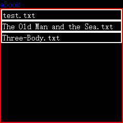
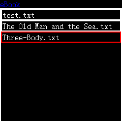
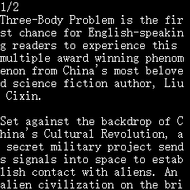
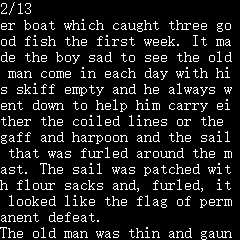

### 多级菜单

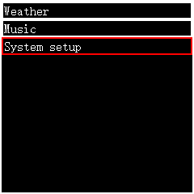
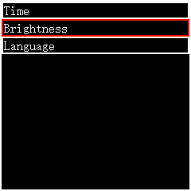
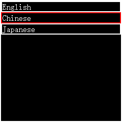

## 按钮示例

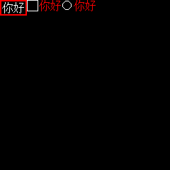

## 容器示例

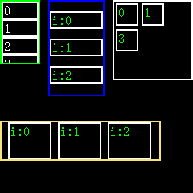

## 输入示例

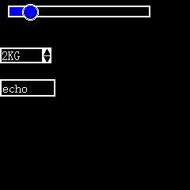

## 文字示例

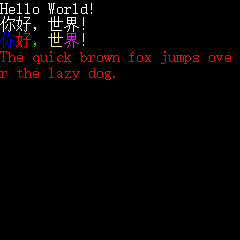
