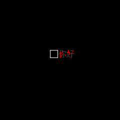

# 按钮

- [按钮](#按钮)
  - [XButton](#xbutton)
    - [属性](#属性)
    - [公共成员方法](#公共成员方法)
    - [详细描述](#详细描述)
  - [XRadio](#xradio)
    - [属性](#属性-1)
    - [公共成员方法](#公共成员方法-1)
    - [详细描述](#详细描述-1)
  - [XCheckbox](#xcheckbox)
    - [详细描述](#详细描述-2)

> 直接修改弱私有属性将导致未知错误!!!

## XButton

`XButton`是包含文字说明的按钮。

`hello_button = XButton((100, 100), text="你好")`

### 属性

- `xtext: XText`显示的文字控件
- `callback: callable`按下回调函数

### 公共成员方法

### 详细描述

---

## XRadio

`XRadio`是包含文字说明的单选框。

`hello_radio = XRadio((100, 100), (49, 16), 16, text="你好")`

### 属性

- `group: list[XRadio]`访问`_group`组别的合法接口
- `checked: bool`访问`_checked`选中状态的合法接口

### 公共成员方法

### 详细描述

---

## XCheckbox

`XCheckbox`是包含文字说明的多选框，实际上是[XRadio](#xradio)的变种子类。

`hello_checkbox = XCheckbox((100, 100), (49, 16), 16, text="你好")`

### 详细描述

---
