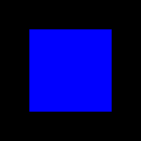
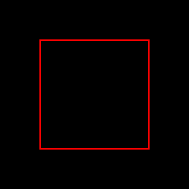
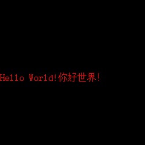

# 基础控件

- [基础控件](#基础控件)
  - [XWidget](#xwidget)
    - [属性](#属性)
    - [公共方法](#公共方法)
    - [详细描述](#详细描述)
  - [XCtrl](#xctrl)
    - [属性](#属性-1)
    - [公共方法](#公共方法-1)
    - [详细描述](#详细描述-1)
  - [XLayout](#xlayout)
    - [属性](#属性-2)
    - [公共成员方法](#公共成员方法)
    - [详细描述](#详细描述-2)
  - [XFrameLayout](#xframelayout)
    - [属性](#属性-3)
    - [公共方法](#公共方法-2)
    - [详细描述](#详细描述-3)
  - [XText](#xtext)
    - [属性](#属性-4)
    - [公共方法](#公共方法-3)
    - [详细描述](#详细描述-4)

> 直接修改弱私有属性将导致未知错误!!!

## XWidget

`XWidget`是所有控件类的基类。

`blue_rect = XWidget((50, 50), (140, 140), BLUE)`

在屏幕上绘制为一个实心矩形。

### 属性

### 公共方法

- `get_absolute_pos() -> tuple[int, int]:`获取控件在屏幕上的绝对坐标。
- `set_parent(parent: "XLayout"):`设置父控件。
- `set_pos(pos: tuple[int, int]):`设置位置。
- `set_wh(wh: tuple[int, int]):`设置大小。
- `set_transfer(pos: tuple[int, int], wh: tuple[int, int]):`设置变换(位置和大小)。
- `set_color(color: int):`设置颜色。

### 详细描述

---

## XCtrl

`XCtrl`是所有[可控制控件](/Readme.md#控件分类)的基类，继承自[XWidget](#xwidget)。

绘制结果与`XWidget`相同

### 属性

- `focused: bool`访问`_focused`焦点的合法接口

### 公共方法

### 详细描述

---

## XLayout

`XLayout`是所有[容器控件](/Readme.md#控件分类)的基类，带有无边框基础平面布局，继承自[XCtrl](#xctrl)。

在屏幕上不绘制任何内容。

### 属性

### 公共成员方法

- `clear():`擦除容器绘制区域
- `draw_deliver():`传递绘制。首先绘制自身，然后将绘制传递到子控件
- `add_widget(widget: XWidget):`添加子控件并调整布局
- `add_widgets(widget: XWidget):`添加多个子控件并调整布局
- `remove_widget(widget: XWidget):`移除子控件并调整布局

### 详细描述

---

## XFrameLayout

`XFrameLayout`是支持焦点切换的容器控件的基类，带有一个可选边框平面布局，同时也是GUI绘制层的默认容器，继承自[XLayout](#xlayout)。

`frame = XFrameLayout((50, 50), (140, 140), frame=True, color=RED)`

在屏幕上绘制一个边框2px的空心矩形。

### 属性

### 公共方法

### 详细描述

---

## XText

`XText`是显示文字的一个类，继承自[XWidget](#xwidget)。

`text = XText((0, 120), context="Hello World!你好世界！", color=RED)`

在屏幕上绘制一个支持多行的文本

### 属性

- `context: str`内容

### 公共方法

### 详细描述

---
